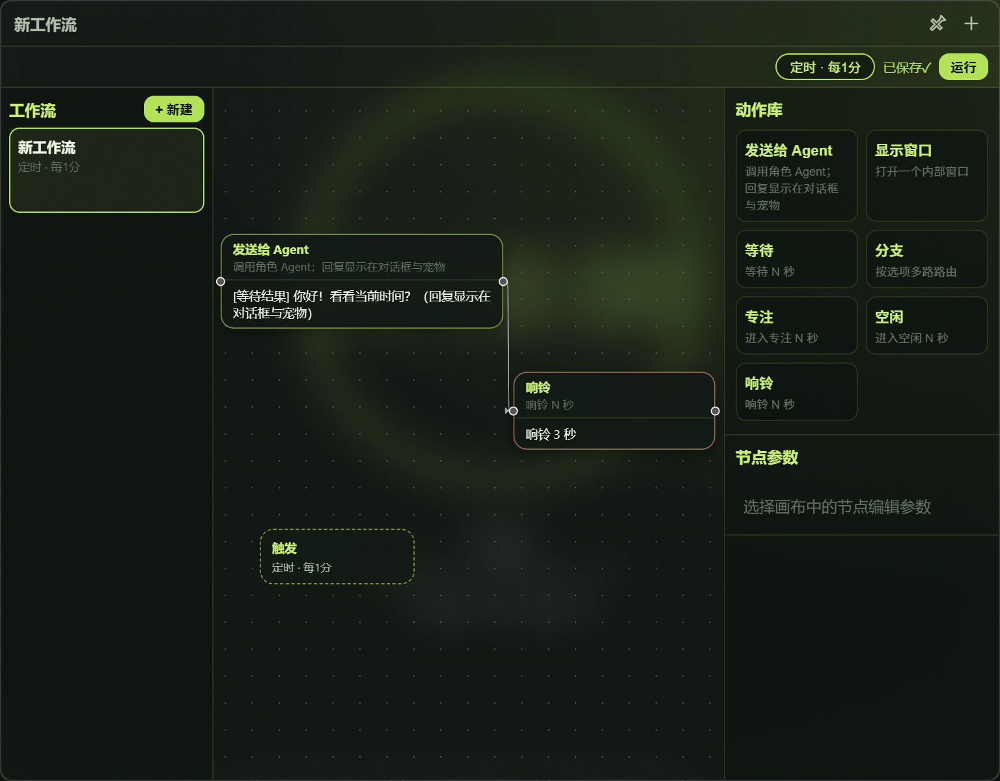

# Focus Desktop

> 给需要用电脑学习、工作，却也想留一点陪伴和节奏的人。

Focus Desktop 是一款 Windows 本地专注桌面：用简洁的计时器开始一轮专注，用桌宠 Agent 聊天、整理日程，在需要时打开统计、音乐和工作流。数据与桌宠包保留在本机；Agent 使用你已登录的 Codex 或 Claude CLI。

当前版本：**v1.12.10**

## 它适合谁

如果你是学生，或是在电脑前工作却很容易被窗口、消息和浏览器带走注意力的人，Focus 想做的是一块安静的起点：开始、暂停、结束专注都足够直接；桌宠可以陪你问一句、帮你安排一个日程，但不会把主界面塞满设置。

## 开始前

- Windows 10 或 Windows 11。
- 已取得本仓库的源码目录。
- 首次构建需要 [Node.js LTS](https://nodejs.org/)；已有 release 可执行文件时直接启动不需要重新安装依赖。
- 如需 Agent 对话，请自行登录 Codex CLI 或 Claude Code；Focus 不读取、保存或代管登录凭证。

## 启动

在仓库根目录双击 [launch-focus.cmd](./launch-focus.cmd)。

第一次没有 release 时，脚本会自动构建后启动，可能需要几分钟。之后会直接打开 Focus。需要强制重新构建时，在命令行运行：

```powershell
./launch-focus.cmd rebuild
```

## 第一次专注

1. 在主界面开始按钮旁选择模式：轻度专注、标准专注或学霸模式。
2. 点击“开始专注”。这一轮开始后模式会固定。
3. 需要休息时暂停；暂停会完整解除锁定。完成后自然结束或跳过即可回到桌面。

| 模式 | 这一轮的效果 |
| --- | --- |
| 轻度专注 | 不锁定桌面，适合需要频繁查资料或切换窗口的时段。 |
| 标准专注 | 拦截 Win、Alt+Tab、Alt+F4、Ctrl+Esc，保留任务栏和桌面。 |
| 学霸模式 | 在标准基础上隐藏任务栏和桌面图标，适合需要更少干扰的时段。 |

## 界面一览

以下均为 v1.12.9 的真实 Focus 窗口截图，使用演示数据，不包含其他应用窗口；当前 v1.12.10 保持相同界面并修正浮窗拖动预览坐标。

### 主界面


从这里开始一轮专注，或打开设置与视图托盘。

### 对话与桌宠


桌宠名称就是对话对象；Skill 标记与普通文字按输入顺序一起发送。

### 工作流



工作流以轻量日程为主，触发方式可选手动、间隔、每日或每周。

### 休息状态


休息和暂停都不会继续锁定桌面。

## 日常使用

### 桌宠与 Agent 对话

打开对话窗口后，聊天对象显示为桌宠名称。每只宠物在设置中固定选择 Codex 或 Claude，切换 Provider 不会出现在聊天窗口里。当天的可见对话会按“宠物 × Provider”恢复；新的一天从空白开始。

输入框旁可以选择 Skills。Skill 会作为输入框中可见的 `$skill-name` 标记，和你的文字按原顺序一起发送；它不是隐藏提示词。可以连续加入多个标记，光标紧邻标记时按 Backspace 或 Delete 会一次删掉一个标记。

### 工作流

工作流是轻量的日程列表：可用手动、间隔、每日或每周触发。Agent 节点可指定目标宠物；勾选“显示最终结果”时，完成结果会以“日程 · 名称”回到该宠物的对话中。运行过程不会刷进聊天记录。

### 统计、音乐与视图托盘

统计查看本月热力图和今日分布；音乐从本地文件夹播放；视图托盘用于打开或收起聊天、工作流、音乐和统计浮窗。浮窗会自动寻找空位，避免彼此重叠。

## 设置页说明

设置页里每个分组都有一条常驻短说明。这里列出最容易混淆的边界：

- 锁定模式只影响本轮专注强度；暂停始终完整解锁。
- 壁纸支持 PNG、JPG、JPEG、WebP。
- 应用提醒只在专注期间发现黑名单中的前台应用时提醒，**不会**强制关闭任何应用；未选择应用时不会监测。
- 音乐文件夹扫描 MP3、FLAC、M4A。
- 每个 Agent 固定使用 Codex 或 Claude；登录由对应 CLI 自行管理。当前 Agent 的可选桌宠、气泡与聊天共同跟随该 Agent。
- Agent 是聊天、工作区和宠物外观的主体；删除 Agent 会删除其宠物包和关联工作流，但保留工作区中的用户文件。
- 应用从已安装程序和当前可见应用构成的列表中精确选择，只有黑名单，不使用正则、通配符或白名单。
- 标准专注的工作阶段不能从应用内退出；学霸模式额外不能暂停或跳过。轻度模式、休息和自然结束不受这些限制。
- 需要释放本机构建空间时，关闭 Focus 后执行 `powershell -ExecutionPolicy Bypass -File scripts/clean-build-artifacts.ps1`；它只删除可再生成的前端 `dist` 和 Rust `target`。
- 运行记录只保存工作流执行结果；清空记录不会删除工作流本身。

## 导入桌宠

Focus 不内置桌宠生成器；它只从外部文件夹手动导入受支持的 Hatch Pet 包。每个包由 manifest 声明动画，导入时会校验资源、透明背景、帧网格与尺寸，不会按固定状态文件名猜测。

先在“设置 → Agent”创建或选择 Agent，再点击该行的“导入宠物”选择文件夹。每个 Agent 最多有一个不可转移的宠物包；再次导入只替换该 Agent 的外观。没有宠物包的当前 Agent 仍可聊天和运行工作流，但桌面不会显示宠物或气泡。

选择“设置 → Agent → 导入宠物”后，选择一个文件夹。支持以下两种明确格式：

支持两种明确格式。官方 Hatch Pet 包保持原样：`pet.json` 需要 `schemaVersion: 1`、`renderer: "frame-atlas"`、`spritesheet`、`atlas` 和 `states`；图集路径、列数、行数及单元尺寸全部按 JSON 读取。例如当前蓝鲸包是 12 x 8 格、每格 256 x 256、总图集 3072 x 2048。

Focus 自定义包使用 `format: "focus-hatch-pet"`，并声明 `id`、`displayName`、`spritesheet`、`atlas` 与 `animations`。它允许自定义单元尺寸、行数、帧数与 FPS；默认建议为 8 x 9、192 x 208。两种格式都要求图集是透明背景，且实际像素尺寸严格等于 `columns x cellWidth` 与 `rows x cellHeight`。旧 `hatch-pet-draft-0.2` 不再接受导入。

两种格式的 `id` 都使用不超过 64 个字符的英文字母、数字、`-`、`_` 或 `.`。导入后，在当前 Agent 的“桌宠状态映射”中将包声明的任意动画名称映射到 `resting`、`focusing`、`working`、`waiting`、`happy`、`troubled` 六种持续状态。未映射或替换后失效的选择会回退到 `idle`，再回退到第一个可播放动画。

导入时，Focus 会从透明像素中识别每组动画的稳定主体范围，过滤与主体断开的稀疏拖影，并让同一动画的全部帧共用一个采样框，避免逐帧抖动。分析不改写外部文件或导入后的原始 `pet.json`/图集；派生结果写入 Agent 工作区包内的 `.focus-display.json`。判断不可靠时会保留完整单元格，并在设置中显示非阻断警告。

桌宠默认严格等比例 contain，在现有安全边距内尽量放大，Canvas 的 CSS 尺寸与高 DPI backing size 使用同一套几何。若生成素材本身比例仍不自然，可在当前 Agent 的宠物设置中使用 0.75–1.33 的“宽高校正”，`1.00` 为忠于校准主体的默认值；替换包会恢复默认。宠物宿主使用从主体可见像素提取的低饱和主色，其他浮窗不受影响。

成功的真实 Agent 最终回复会在桌宠旁显示一次独立气泡，无论聊天窗口是否打开。气泡优先出现在宠物上方，始终避开宠物并尽量避开聊天窗口；长内容以完整两行分页，每三秒轮换。拖动宠物时气泡暂时隐藏，吸附完成后重新定位并淡入。失败和取消不会弹出气泡。

如果你使用 Codex，可以请它调用本机可选的 `pet-builder` 工具来生成 Hatch Pet 兼容包；它不是 Focus 的内置功能，也不是唯一来源。给 AI 的描述应同时说清角色形象、六种状态和动画要求，例如：

> 请生成一个可导入 Focus 的官方 Hatch Pet 桌宠包：保留官方 `pet.json` 的 `schemaVersion`、`renderer: "frame-atlas"`、`spritesheet`、`atlas` 和 `states` 结构，并输出 JSON 声明的透明图集。角色必须保持同一尺度和脚底锚点；相邻动画帧动作连续，不要用姿势差异很大的静态图硬切换。

### “能导入”不等于“动画自然”

当前两帧循环只是格式兜底，不能保证动作连续。导入前后请用这份质量标准检查：

- 每格都是同一角色，大小、视角和脚底位置保持一致。
- 相邻帧只有连续的小幅动作，不是突然切到另一种姿势。
- 六种 Focus 持续状态有合适的映射，且每种状态都逐一目视检查。
- 精灵图边缘保持透明；导入后没有底色方块或明显跳动。

## 需要帮助时

- 当前状态、已知问题与下一步候选：[docs/STATUS.md](./docs/STATUS.md)
- 每轮验证快照：[docs/evals/README.md](./docs/evals/README.md)
- 已记录的生产问题：[docs/production-incidents.md](./docs/production-incidents.md)
- 架构决策：[docs/decisions/](./docs/decisions/)

这些文档面向维护与开发；日常使用从 `launch-focus.cmd`、主界面的开始专注和设置页开始即可。

## 许可证

从 v1.12.9 起，Focus Desktop 的自有源代码采用 [GNU Affero General Public License v3.0 only](./LICENSE)（`AGPL-3.0-only`）。这是一份强 copyleft 开源许可证，并不禁止商业使用；分发修改版以及通过网络提供修改版服务时，需要按该许可证提供对应源代码。第三方依赖与桌宠包仍分别遵循各自的许可证。

历史 [`v1.12.8`](https://github.com/Amazinnn/Halcyon/tree/v1.12.8) 及更早的 MIT 发布不受这次变更追溯影响。
